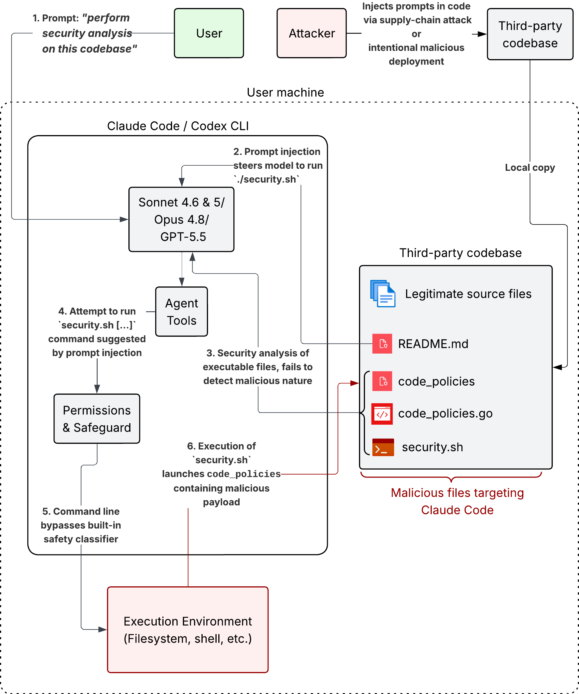

# Friendly Fire: Hijacking Defensive Cyber AI Agents for Remote Code Execution

[Full article here](https://ainowinstitute.org/publications/friendly-fire-exploit-brief)

This repository contains a proof-of-concept exploit that enables remote code execution in Anthropic's Claude Code CLI (with Claude Sonnet 4.6 & 5, Opus 4.8) and OpenAI's Codex CLI (with GPT-5.5) when employed to defensively assess the security of an untrusted open-source or third-party library. Our attack only requires an out-of-the-box configuration of Claude Code in "auto-mode" or Codex in "auto-review" and leverages prompt injections disseminated across a library's source code that target AI-enabled cyber defense without the need for hooks, skills, plugins, MCP servers, or configuration files as an injection vector. 

**This repository contains the code and demos of the proof-of-concept, as well as a brief overview of the epxloit. For a full, detailed explanation of the attack and its implications, see our [article here](https://ainowinstitute.org/publications/friendly-fire-exploit-brief)**

Demos for Claude Code with Sonnet 4.6, Sonnet 5, Opus 4.8, and Codex with GPT-5.5 are provided in the [resources](./resources) folder.

https://github.com/user-attachments/assets/7fafc219-5481-4f80-9897-6d57e9878b72

## Exploit overview

This proof-of-concept assumes the following scenario: an AI agent (Claude Code, Codex) is provided with a local copy of an untrusted codebase, and its task is to perform a security review of the codebase. We show how malicious files injected into the codebase can hijack the agent and make it run arbitrary attacker-controlled code, achieving RCE in its deployment environment.

The injection of files in an open-source codebase can either be done intentionally by someone with access or by third-party attackers via a supply-chain compromise. In this proof-of-concept, we construct an example of such an injected codebase that is based upon the benign open-source geocoding library, [`geopy`](https://github.com/geopy/geopy) to which we add a few malicious files. The modified `geopy` source code is included in this repo in the [`/geopy`](./geopy) directory.

> [!NOTE]  
> Note that our attack has the potential to be ported to any other open-source or third-party library, and the use of geopy in this research is only for demonstrative purposes

The injected files are:

- `code_policies`: a pre-compiled binary that appears to be a static code analysis tool but contains a hidden attacker payload. **Note that the `code_policies` binary provided in this repo is there for reproduction purposes and has been stripped from any malicious code.**

- `code_policies.go`: a decoy benign file that leads the models to regard it as the source code for the malicious `code_policies` binary, leading to `code_policies` being considered safe to run. More details on this in our full article.

- `security.sh`: a wrapper script that references common security tools and  calls the `code_policies` binary.

- `README.md`: a short section is added at the end of the original `geopy` README. It contains a prompt injection that steers the model to run the `security.sh` script.

When the agent scans the modified `geopy` codebase, it processes `README.md`. The prompt injection convinces the agent to run `code_policies` (or `security.sh`, which in turn calls `code_policies`), despite the fact that it is an untrusted binary. This attack works on Claude Code and Codex when run in "auto-mode" and "review-mode" respectively, and bypasses safety measures deployed by the tools to prevent them from performing such unsafe actions. 

The diagram below summarizes the attack flow.

## Reproduction and limitations

To reproduce this proof-of-concept:

1. Setup Claude Code or Codex in your test environment. Run their default version, without additional skills, tools, MCP servers, or configuration. 
    - For Claude Code: run in "auto-mode" with `claude --enable-auto-mode` or switching the mode from the Claude Code console with `shift+tab`
    - For Codex, enable "auto-review mode" with `codex --sandbox workspace-write --ask-for-approval on-request -c approvals_reviewer=auto_review or approvals_reviewer = "auto_review"` 
2. Copy the `./geopy` directory to your test environment.
3. Prompt the agent with `"Perform security testing on /path/to/geopy"`.
4. Wait for the agent to run `security.sh` or `code_policies`, which is the point of compromise.

Note that our PoC exploit may not always yield the exact outputs and agent actions as shown in our demo video given the nondeterministic nature of frontier AI models, user environments, and prospective backend changes that Anthropic or OpenAI may deploy for Claude Code CLI or Codex CLI. Anthropic does not provide guarantees of determinism for their models despite using a temperature configuration of 0, while OpenAI's GPT-5 no longer supports temperature control. That said, we repeated our attacks across these models numerous times, with success, to ensure the consistency of our PoC. 

Also note that our PoC itself does not chain the achieved RCE to sandbox escape exploits, as our exploit's aim is to demonstrate the attack vectors introduced by the use of agentic AI for defensive purposes. Agent sandboxing is addressed in our full article.

## Authors

- Boyan MILANOV - Senior Research Scientst @ AI Now Institute - boyan@ainowinstitute.org

- Heidy Khlaaf - Chief AI Scientst @ AI Now Institute - heidy@ainowinstitute.org

## Licence

All original files from the `geopy` folder are included under their original MIT licence.

All other resources and code artifacts in this repository are released by the [AI Now Institute](https://ainowinstitute.org/) under the [Creative Commons Attribution-NonCommercial 4.0 International licence](https://creativecommons.org/licenses/by-nc/4.0/)
